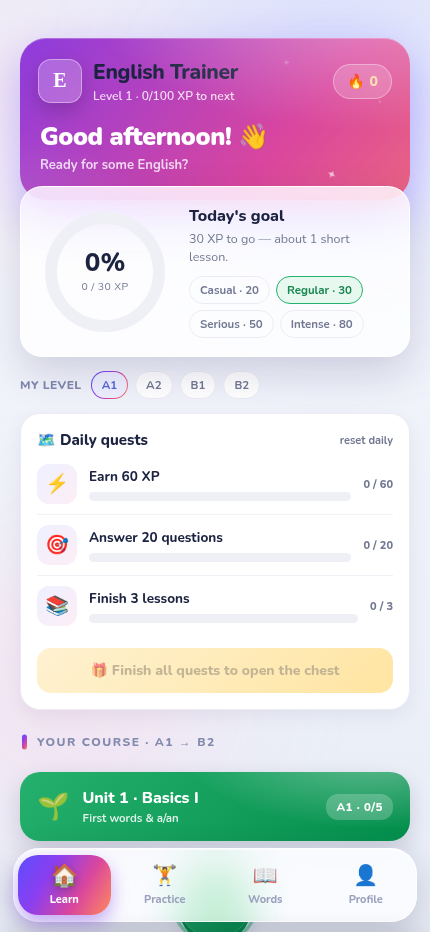
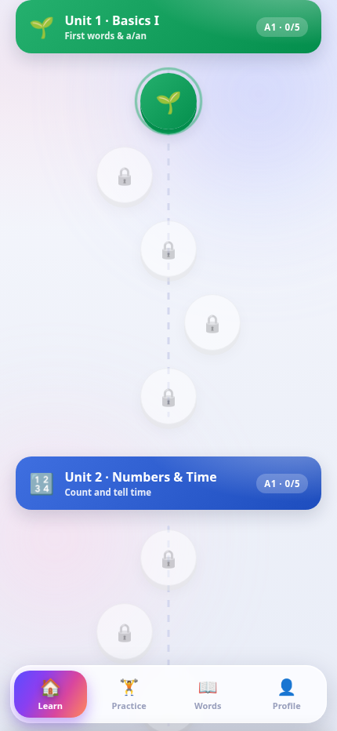
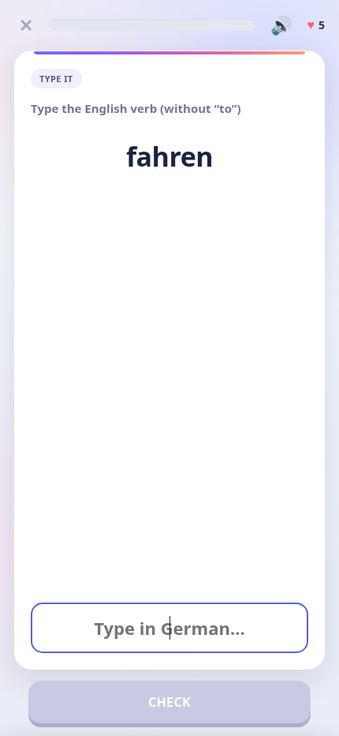
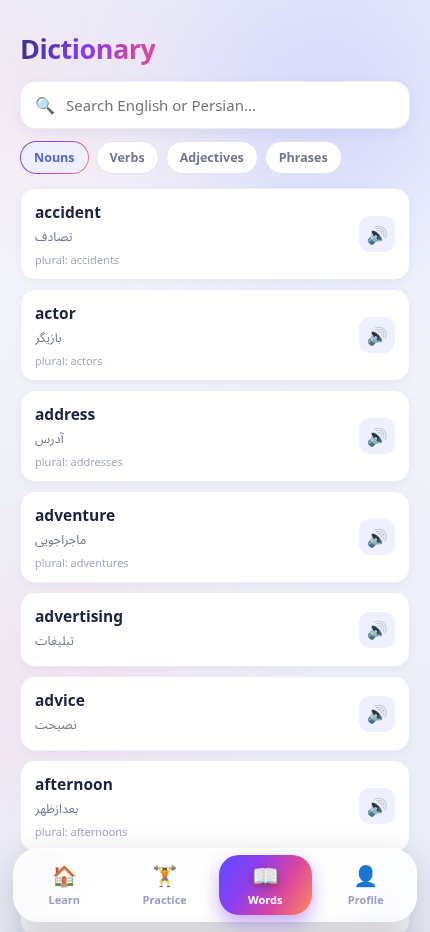

<div align="center">


# English Trainer

**A beautiful, offline-first English trainer — from A1 to B2.**
Grammar, vocabulary, listening and more, in a fast Duolingo-style app that installs to your home screen. **Persian (فارسی) support translations.** No account, no ads, no tracking.

[](https://bluerrror.github.io/english-trainer/)
&nbsp;


</div>

---

## ✨ Features

- **🗺️ Structured course (A1 → B2)** — 14 themed units × 5 lessons on a Duolingo-style path with locks, star ratings and a boss lesson per unit: a/an, present simple, plurals, past simple, -ing forms, comparatives, prepositions, perfect & modals, conditionals…
- **📊 Pick your level** — choose A1–B2 and every practice session adapts its question mix.
- **🔁 Mistake review** — wrong answers are saved automatically and replayed until you clear them.
- **🎯 No repeats** — the question engine remembers what it asked and always serves fresh questions.
- **🗓️ Daily quests & chest** — three rotating goals per day with a bonus-XP reward chest.
- **📖 Massive built-in dictionary** — 1000+ nouns with plurals, 250+ verbs with past & participle forms, 130 adjectives and 100+ phrases, all searchable with audio and Persian translations.
- **🎧 Listening** — hear real English (your device's voices): tap what you hear, type it, or rebuild the sentence from tiles.
- **🔊 Read-aloud & voices** — questions, words and sentences are read to you in English; mute anytime from the lesson bar, and pick your voice in Settings.
- **🔗 Match pairs, ⌨️ typing, 🧩 sentence builder, 🖼️ pictures, ✅ true/false** — many distinct exercise types.
- **📘 Real English grammar engine** — a/an by sound, irregular plurals (child → children), third-person -s (watch → watches), -ing spelling rules, 70+ irregular verbs (go–went–gone), comparatives & superlatives, modal verbs, in/on/at.
- **🎮 Game feel** — XP, hearts, daily goal ring, streaks, combos, sound effects, haptics, confetti and an achievements wall.
- **💾 Private & offline** — progress saves on your device only; after the first load it runs with no internet.

## 📱 Screenshots

<div align="center">

&nbsp;

&nbsp;

&nbsp;

</div>

## 🚀 Install on your iPhone (≈2 minutes)

1. Open **Safari** on your iPhone and go to **[bluerrror.github.io/english-trainer](https://bluerrror.github.io/english-trainer/)**.
2. Wait a few seconds so it caches for offline use.
3. Tap the **Share** button (□↑) → **Add to Home Screen** → **Add**.

You'll get an **"E" icon** on your home screen that opens **fullscreen** and **works offline**. On Android/Chrome, use the **⋮ menu → Install app**.

## 🛠️ Tech

- A **single `index.html`** plus a vocabulary pack (`vocab.js`) — vanilla HTML, CSS and JavaScript. **Zero dependencies, no build step.**
- Installable **PWA**: web manifest + service worker for offline caching (self-hosted Nunito font included).
- **Web Speech API** for pronunciation, **Web Audio API** for sound effects, `navigator.vibrate` for haptics.
- Hosted free on **GitHub Pages**.
- Sister app: **[Deutsch Trainer](https://github.com/Bluerrror/deutsch-trainer)** — the same app for learning German.

## 💻 Run locally

```bash
git clone https://github.com/Bluerrror/english-trainer.git
cd english-trainer
python3 -m http.server 8000      # then open http://localhost:8000
```

## 📄 License

Released under the [MIT License](LICENSE).

<div align="center">
<sub>Made with ❤️ for English learners · <a href="https://bluerrror.github.io/english-trainer/">Open the app →</a></sub>
</div>
